<!-- ══════════════════════════════════════════════════════════ -->
<!--              HEADER SVG ANIMADO (hospedado no repo)      -->
<!-- ══════════════════════════════════════════════════════════ -->

<div align="center">
  
</div>

<br/>

<div align="center">

<!-- Typing SVG -->
<a href="https://github.com/Luiszapataa">
  
</a>

</div>

<br/>

---

<!-- ══════════════════════════════════════════════════════════ -->
<!--                   SOBRE MIM                              -->
<!-- ══════════════════════════════════════════════════════════ -->

## 🧬 Sobre mim



```
╔══════════════════════════════════════════╗
║       LUIS FELIPE ALVES ZAPATA           ║
║       Backend Developer                  ║
╠══════════════════════════════════════════╣
║  📍  Penápolis, SP — Brasil              ║
║  🎓  Eng. Software · FUNEPE · 2027       ║
║  💼  GTNOX · Acessórios Automotivos      ║
║  🔬  Pesquisador IoT & IA · FUNEPE       ║
╠══════════════════════════════════════════╣
║  ☕  foco  →  Java · Spring Boot         ║
║  🔷  also  →  C# · .NET · OCR Systems   ║
║  🌱  learn →  Clean Arch · System Design ║
╠══════════════════════════════════════════╣
║  🚀  building  ──────────────────────── ║
║      · OficinaTech OS  (Java/Spring)     ║
║      · AlfaVed v3      (Freelance)       ║
╠══════════════════════════════════════════╣
║  🎯  meta → 1ª oportunidade como Dev    ║
║  📬  luiszapataconta@gmail.com           ║
╚══════════════════════════════════════════╝
```

<br clear="right"/>

---

<!-- ══════════════════════════════════════════════════════════ -->
<!--                     TECH STACK                           -->
<!-- ══════════════════════════════════════════════════════════ -->

## 🛠️ Stack Técnica

<div align="center">

### ⚡ Principal — Backend


### 🗄️ Banco de Dados


### 🌐 Web & Frontend


### 🔧 Ferramentas & DevOps


### 🧪 Hardware, IoT & Especiais


### 📐 Metodologias


</div>

<br/>

---

<!-- ══════════════════════════════════════════════════════════ -->
<!--                     PROJETOS                             -->
<!-- ══════════════════════════════════════════════════════════ -->

## 🚀 Projetos em Destaque

<div align="center">

| 🔖 | Projeto | Descrição | Stack | Status |
|:---:|---|---|---|:---:|
| 🖥️ | **[Totem de Check-In com OCR](https://github.com/Luiszapataa/totem-checkin-ocr)** | Sistema offline de autoatendimento: webcam captura documento, OCR extrai CPF, valida agendamento e imprime senha térmica. 27 págs. de documentação. | `C#` `.NET` `Tesseract OCR` `Windows Forms` | ✅ Concluído |
| 🏭 | **[Alfaved.com.br](https://alfaved.com.br)** | Site institucional freelance para cliente industrial real. Figma → código → hospedagem + domínio. | `HTML5` `CSS3` `JavaScript` `Figma` | 🟢 No ar |
| 🔧 | **[OficinaTech OS](https://github.com/Luiszapataa)** | Sistema web de ordens de serviço para oficina mecânica. Projeto de Extensão Curricular IV e V — FUNEPE. | `Java` `Spring Boot` `PostgreSQL` | 🔄 Em progresso |
| 🔬 | **Pesquisa IoT & IA — FUNEPE** | Pesquisa científica (2023–atual): sistema de monitoramento com sensores, modelagem de BD e backend. | `ESP32` `Raspberry Pi` `PostgreSQL` `IA` | 🔬 Pesquisa |
| 📱 | **[ZoomAlert — Figma](https://www.figma.com/design/MZHN79ap4O53eaNCol9efc/ZoonAerta?node-id=0-1)** | Protótipo navegável de app com foco em usabilidade. UX, hierarquia visual e testes com usuário simulado. | `Figma` `UX Design` `IHC` | ✅ Concluído |
| 🎬 | **[CineDev](https://github.com/Luiszapataa)** | Primeiro projeto da graduação, apresentado na Feira de Profissões da FUNEPE. Cinema fictício completo. | `HTML5` `CSS3` `JavaScript` | ✅ Concluído |

</div>

<br/>

---

<!-- ══════════════════════════════════════════════════════════ -->
<!--                     TRAJETÓRIA                           -->
<!-- ══════════════════════════════════════════════════════════ -->

## 📅 Trajetória

```
2023 ──────────────────────────────────────────────────────────── 2026+

 [2023]  Ingressou em Eng. de Software · FUNEPE · Penápolis SP
    │
    ├──► Início da Pesquisa Científica IoT & IA na Saúde · FUNEPE
    │
 [2023–24] Faturador E-commerce · AP Meirelles Digital
    │       ERP (Bling, Tiny) · notas fiscais · alto volume
    │
 [2024]  Congresso Universitário FUNEPE
    │    Apresentação: IA integrada em fluxos Scrum e Kanban
    │
    ├──► Totem de Check-In com OCR → C# · .NET · Tesseract
    │    27 páginas de documentação · sistema em uso real ✅
    │
    ├──► CineDev → Feira de Profissões FUNEPE ✅
    │
 [2025]  Desenvolvedor Freelancer · Alfaved Soluções Industriais
    │    Figma → código → hospedagem → domínio próprio 🟢
    │
    ├──► OficinaTech OS → Java · Spring Boot · Extensão Curricular 🔄
    │
 [Atual] Colaborador · GTNOX · Acessórios Automotivos
    │
    └──► 🎯 Buscando 1ª oportunidade como Dev Backend (Java/Spring Boot)
```

<br/>

---

<!-- ══════════════════════════════════════════════════════════ -->
<!--              CERTIFICAÇÕES                               -->
<!-- ══════════════════════════════════════════════════════════ -->

## 🎓 Formação & Certificações

<div align="center">

| 📜 | Certificação / Formação | Instituição | Período |
|:---:|---|---|---|
| 🎓 | Bacharelado em **Engenharia de Software** | FUNEPE | 2024 – 2027 |
| ☕ | **Java Completo — POO** (Nélio Alves) | Udemy | 2024 |
| 🍃 | **Backend com Java e Spring Boot** | Santander Bootcamp · DIO | 2024 |
| 🤖 | **Big Data e Produtividade com IA** | FUNEPE | 2024 |

</div>

<br/>

---

<!-- ══════════════════════════════════════════════════════════ -->
<!--                     CONTATO                              -->
<!-- ══════════════════════════════════════════════════════════ -->

## 📡 Contato

<div align="center">

[](https://portfolio-luiszapataport.vercel.app)

<br/>

[](https://www.linkedin.com/in/luiszapataaa/)
[](mailto:luiszapataconta@gmail.com)
[](https://github.com/Luiszapataa)

</div>

<br/>

---

<!-- ══════════════════════════════════════════════════════════ -->
<!--                     FOOTER                               -->
<!-- ══════════════════════════════════════════════════════════ -->

<div align="center">


</div>
